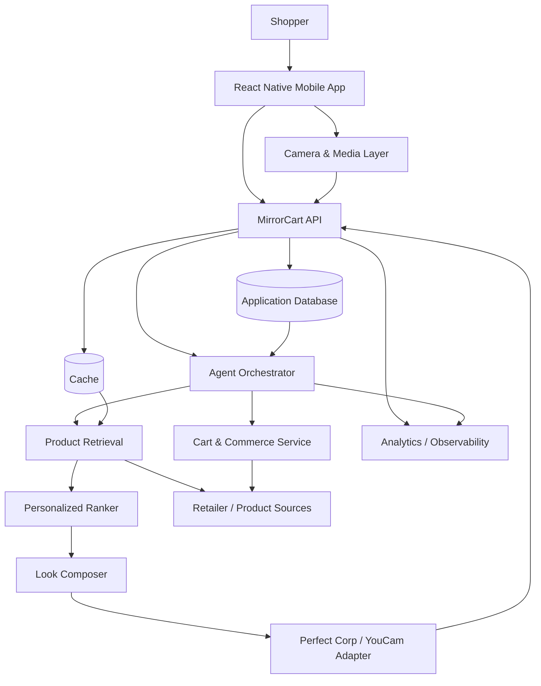
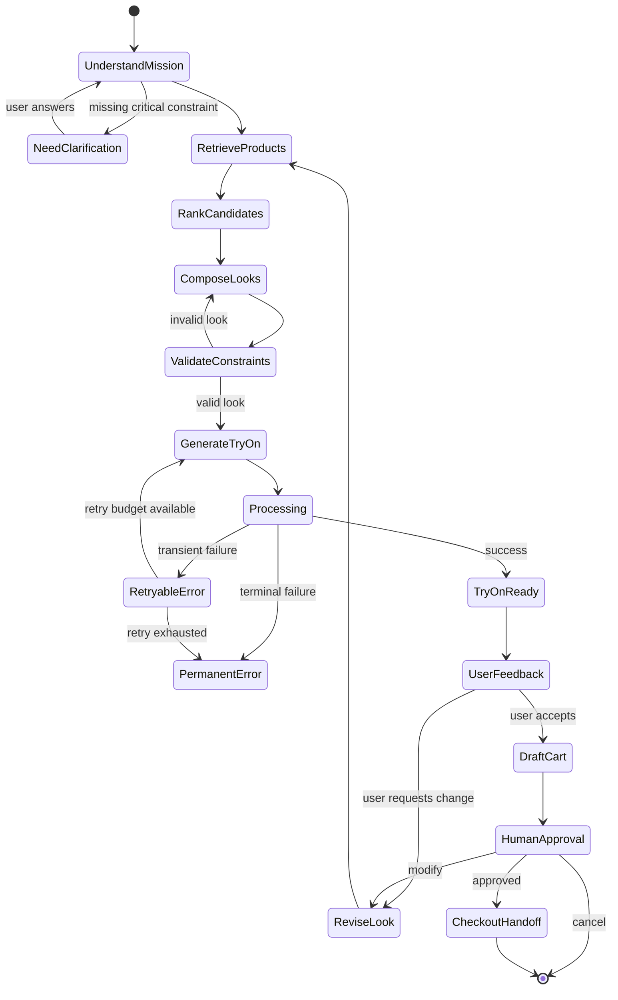
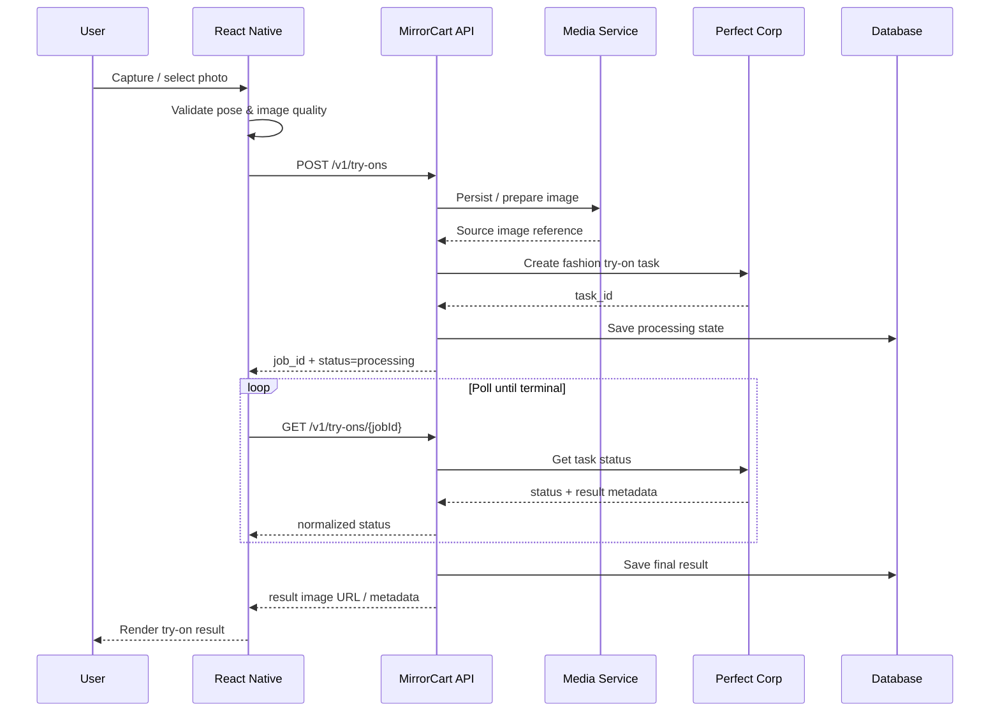
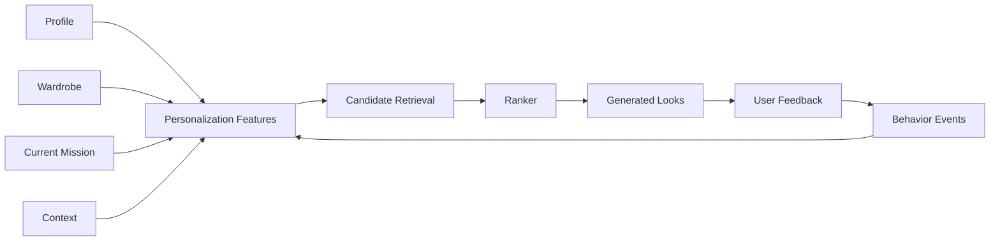
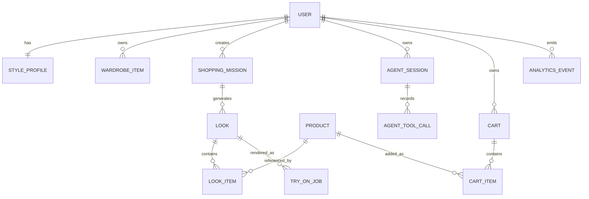
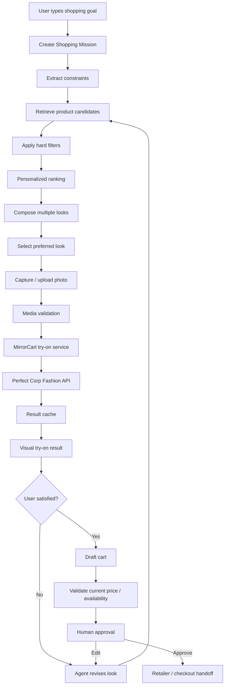
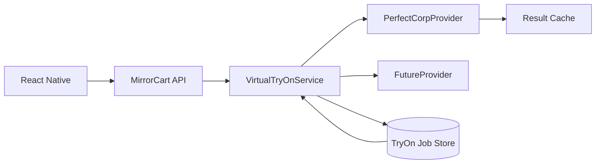
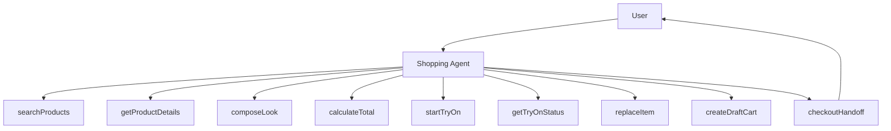
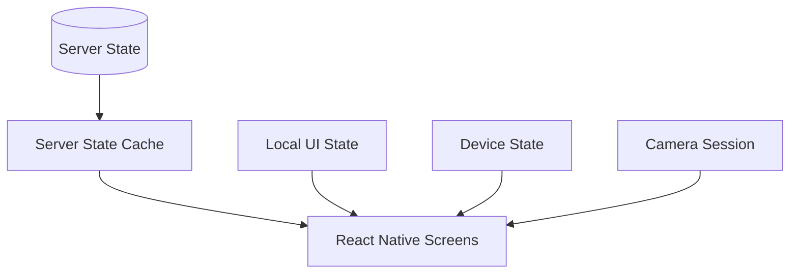

# MirrorCart

## See it. Style it. Shop it.

> **MirrorCart is a mobile AI stylist that combines personalized ecommerce discovery, AI-powered virtual try-on, and agentic shopping in one React Native experience.**

MirrorCart helps a shopper go from a natural-language fashion goal to a complete, personalized, visually validated, shoppable look.

Instead of:

`Search → Browse → Compare → Imagine → Buy`

MirrorCart is designed around:

`Tell us what you need → Build the look → See it on you → Refine it → Shop it`

The core experience combines:

* **AI shopping agents** that translate natural language into structured shopping missions.
* **Personalized product discovery** using preferences, context, behavior, wardrobe signals, and budget.
* **Perfect Corp / YouCam fashion AI** for image-based virtual try-on.
* **React Native mobile UX** optimized for camera-first interactions.
* **Agentic commerce orchestration** that can search, rank, compose, replace, calculate, and prepare a cart while preserving human approval at checkout.
* **Live-data architecture** designed to minimize hard-coded mock data in production flows.

---

## Table of Contents

1. [Why MirrorCart Exists](#why-mirrorcart-exists)
2. [Product Vision](#product-vision)
3. [Core User Journey](#core-user-journey)
4. [Feature Set](#feature-set)
5. [Architecture](#architecture)
6. [Technical Architecture Diagram](#technical-architecture-diagram)
7. [Agentic AI System](#agentic-ai-system)
8. [Agent Workflow Diagram](#agent-workflow-diagram)
9. [AR and Virtual Try-On Pipeline](#ar-and-virtual-try-on-pipeline)
10. [AR Technical Diagram](#ar-technical-diagram)
11. [Personalization Engine](#personalization-engine)
12. [Data Model](#data-model)
13. [Data Model Diagram](#data-model-diagram)
14. [React Native Application Structure](#react-native-application-structure)
15. [API Contracts](#api-contracts)
16. [Perfect Corp / YouCam Integration](#perfect-corp--youcam-integration)
17. [Camera and Media Engineering](#camera-and-media-engineering)
18. [Commerce and Cart Orchestration](#commerce-and-cart-orchestration)
19. [Monetization Architecture](#monetization-architecture)
20. [Security and Privacy](#security-and-privacy)
21. [Caching, Reliability, and Offline UX](#caching-reliability-and-offline-ux)
22. [Observability and Analytics](#observability-and-analytics)
23. [Testing Strategy](#testing-strategy)
24. [Performance Engineering](#performance-engineering)
25. [Local Development](#local-development)
26. [Environment Variables](#environment-variables)
27. [Running the Mobile App](#running-the-mobile-app)
28. [Backend Development](#backend-development)
29. [Project Structure](#project-structure)
30. [Deployment](#deployment)
31. [CI/CD](#cicd)
32. [Hackathon Demo Script](#hackathon-demo-script)
33. [Demo Mode](#demo-mode)
34. [Submission Checklist](#submission-checklist)
35. [Roadmap](#roadmap)
36. [Contributing](#contributing)
37. [License](#license)
38. [Acknowledgements and References](#acknowledgements-and-references)

---

## Why MirrorCart Exists

Fashion ecommerce is optimized around catalog discovery, not confidence.

A shopper may know the outcome they want without knowing the exact product they need:

> “I need something polished for a dinner date.”

> “I have white sneakers. Build me three outfits under $180.”

> “I want to look elegant at a wedding without wearing black.”

> “Make this outfit more casual.”

Conventional filters force those goals into fields such as category, color, size, and price. Human shopping behavior is richer than that.

MirrorCart starts with the **mission** rather than the catalog.

The agent interprets what the shopper is trying to accomplish, searches the available catalog, composes a look, visualizes it, learns from the shopper's reaction, and prepares the final commerce action.

The product thesis is simple:

> **The best shopping assistant is not the one that finds the most products. It is the one that helps the shopper become confident in the right decision.**

---

## Product Vision

MirrorCart is designed to become a **visual interface between people and ecommerce**.

### North-star experience

A shopper should eventually be able to say:

> “I am going to Barcelona for five days. Build four outfits using what I own, keep new purchases under $400, make everything mix-and-match, and show me what each look will look like on me.”

The system should be able to:

1. Understand trip context.
2. Inspect the user's saved wardrobe.
3. Identify missing pieces.
4. Search live products.
5. Create candidate outfits.
6. Check budget and compatibility.
7. Generate visual try-on outputs.
8. Ask for the smallest useful clarification when necessary.
9. Revise the looks from natural-language feedback.
10. Prepare a final cart or retailer handoff.

### Design principles

**Visual first.** Fashion decisions benefit from visualization.

**Agentic, not autonomous-by-default.** The AI can perform reversible shopping actions; financially consequential actions remain user-approved.

**Grounded, not hallucinated.** The agent should operate on structured products and verified application state.

**Personalized, not generic.** User context should materially affect recommendations.

**Mobile-native.** Camera, gestures, image upload, and fast browsing are first-class interactions.

**Premium, not cluttered.** AR surfaces should preserve the user’s face/body/image as the primary visual canvas.

---

## Core User Journey

### Stage 1: Define the mission

The user types or speaks a request.

Example:

```text
I need a date-night outfit under $200.
I like neutral colors but want one statement accessory.
```

MirrorCart converts that request into structured context:

```json
{
  "occasion": "date_night",
  "budget": 200,
  "style": ["elegant", "minimal"],
  "preferred_colors": ["neutral"],
  "statement_accessory": true
}
```

### Stage 2: Retrieve candidates

The agent searches live product sources and normalizes results into a common model.

### Stage 3: Compose looks

The agent creates several combinations instead of returning one flat list.

### Stage 4: Visualize

The user captures or uploads a suitable photo. MirrorCart submits the user image and garment reference images to the server-side Perfect Corp integration.

### Stage 5: Refine

The shopper can say:

```text
Make it less formal.
```

or:

```text
Keep the dress, but replace the shoes with something I can walk in.
```

The agent changes only what is necessary and regenerates the look.

### Stage 6: Shop

The final look becomes a draft cart or retailer handoff.

The user confirms before a purchase action.

---

## Feature Set

### AI Stylist

* Natural-language shopping requests.
* Style and occasion understanding.
* Budget-aware recommendations.
* Follow-up questions only when useful.
* Conversational refinement.
* Explanation of recommendation rationale.

### Personalized Discovery

* Favorite brands.
* Preferred colors.
* Style profile.
* Price sensitivity.
* Category affinity.
* Saved products and looks.
* Wardrobe-aware recommendations.
* Session-level intent.

### AR / Virtual Try-On

* User photo capture/upload.
* Framing guidance.
* Image quality checks.
* Asynchronous job state.
* Try-on result rendering.
* Before/after comparison.
* Item replacement.
* Complete-look previews.
* Retry and recovery states.

### Agentic Commerce

* Search products.
* Rank candidates.
* Build looks.
* Swap items.
* Recalculate budgets.
* Create draft carts.
* Prepare retailer handoffs.
* Maintain user approval at checkout.

### Ecommerce

* Product detail.
* Variant selection.
* Price display.
* Wishlist.
* Cart.
* Retailer links.
* Availability/fulfillment data when available.

### Monetization-ready foundation

* Premium AI styling.
* Virtual try-on credits.
* Subscription entitlements.
* Affiliate attribution.
* Retailer referral revenue.
* Premium personalization.
* Feature experiments.

---

# Architecture

MirrorCart separates five major responsibilities:

1. **Mobile experience** — React Native UI, camera, interaction, local state.
2. **Application backend** — user state, product normalization, agent sessions, carts, entitlements.
3. **Agent orchestration** — tools, state machine, planning, ranking, guardrails.
4. **Visual AI** — Perfect Corp / YouCam fashion API adapter.
5. **Commerce providers** — product sources, retailer links, availability, checkout handoff.

The design goal is that no single external vendor becomes the owner of the entire product domain.

---

## Technical Architecture Diagram



### Why this decomposition matters

The React Native client should not contain provider secrets, commerce credentials, or the final authority for cart state.

The server should remain authoritative for:

* user identity,
* entitlements,
* product truth,
* agent state,
* try-on tasks,
* carts,
* billing state,
* analytics events.

The mobile app should remain responsible for:

* interaction,
* presentation,
* camera capture,
* accessibility,
* local caching,
* optimistic UI for reversible state.

---

# Agentic AI System

MirrorCart's AI should behave like a **tool-using shopping operator**, not a text generator.

## Agent responsibilities

The agent should be able to:

* understand a shopping mission,
* identify hard vs soft constraints,
* retrieve candidates,
* rank candidates,
* compose a look,
* explain its decision,
* initiate try-on,
* respond to corrections,
* swap products,
* recompute totals,
* create a draft cart.

### Hard constraints

Hard constraints should normally be treated as blockers:

* maximum budget,
* required category,
* explicit color exclusion,
* required retailer,
* unavailable product,
* user-selected size/variant.

### Soft preferences

Soft preferences can be traded off:

* “prefer neutral colors,”
* “I like minimalist styling,”
* “something similar to this,”
* “make it more modern.”

This separation helps the agent avoid making irrational substitutions.

---

## Agent Workflow Diagram



The explicit state machine is useful because LLM reasoning is probabilistic while shopping state must be deterministic.

---

## Agent Tool Contract

A simple tool interface can look like this:

```ts
export interface ShoppingToolContext {
  userId: string;
  sessionId: string;
  locale: string;
  currency: string;
}

export interface SearchProductsInput {
  query?: string;
  categories?: string[];
  colors?: string[];
  priceMax?: number;
  brands?: string[];
  limit?: number;
}

export interface SearchProductsOutput {
  products: ProductSummary[];
  nextCursor?: string;
}
```

Tools should return structured objects instead of prose whenever possible.

Example:

```ts
const result = await tools.searchProducts({
  query: "minimal date night dress",
  categories: ["dress"],
  colors: ["cream", "black", "beige"],
  priceMax: 120,
  limit: 20,
});
```

The model can explain the results to the shopper, but the application should maintain the actual product facts.

---

# AR and Virtual Try-On Pipeline

MirrorCart uses the camera and image pipeline as a deliberate part of the shopping decision loop.

The user should never feel as if they have left the shopping experience to “go use an AI image tool.”

The experience is:

`Select look → Prepare user image → Try on → Compare → Refine → Try on again`

Perfect Corp's current Fashion API family supports AI-powered virtual try-on workflows for categories including clothes, shoes, bags, scarves, and hats. The current AI Clothes documentation describes a workflow involving user/reference images, task creation, and task-status polling. See the references section for the official documentation.

---

## AR Technical Diagram



### Asynchronous design

Do not block the React Native JS thread waiting for an AI image task.

A robust job record should include:

```ts
export type TryOnStatus =
  | "created"
  | "uploading"
  | "queued"
  | "processing"
  | "succeeded"
  | "failed"
  | "cancelled";

export interface TryOnJob {
  id: string;
  userId: string;
  lookId: string;
  provider: "perfect";
  status: TryOnStatus;
  providerTaskId?: string;
  resultUrl?: string;
  errorCode?: string;
  retryCount: number;
  createdAt: string;
  updatedAt: string;
}
```

### Retry rules

Retry only errors that are likely transient:

* network timeout,
* upstream 5xx,
* temporary provider availability,
* rate limiting with a bounded retry policy.

Do not endlessly retry:

* invalid images,
* unsupported parameters,
* policy rejections,
* missing provider credentials,
* malformed payloads.

---

# Personalization Engine

MirrorCart personalization should combine four categories of information.

## 1. Explicit profile signals

* style preferences,
* favorite colors,
* favorite brands,
* disliked categories,
* preferred price range,
* sizing preferences.

## 2. Behavioral signals

* views,
* saves,
* skips,
* try-ons,
* look acceptance,
* product swaps,
* purchase outcomes.

## 3. Contextual signals

* current shopping mission,
* occasion,
* season,
* weather where intentionally supported,
* location context where permitted,
* trip or event context.

## 4. Wardrobe context

* existing pieces,
* recently worn items,
* wardrobe gaps,
* color distribution,
* compatible categories.

---

## Recommendation Score

A practical first version can use a weighted score rather than a complex recommender model:

```text
score =
    0.25 * mission_match
  + 0.20 * style_match
  + 0.15 * budget_fit
  + 0.10 * color_match
  + 0.10 * category_fit
  + 0.10 * wardrobe_complement
  + 0.05 * popularity
  + 0.05 * commerce_quality
```

The weights should be remotely configurable so they can be tested without an app release.

Later versions can replace or augment this formula with learned ranking models and multimodal embeddings.

---

## Personalization Feedback Loop



This loop creates a natural path from deterministic personalization toward more advanced AI recommendation systems.

---

# Data Model

The minimum persistent data set should be application-oriented rather than UI-oriented.

## User

```ts
interface User {
  id: string;
  email?: string;
  displayName?: string;
  createdAt: string;
}
```

## StyleProfile

```ts
interface StyleProfile {
  userId: string;
  favoriteColors: string[];
  favoriteBrands: string[];
  preferredStyles: string[];
  dislikedStyles: string[];
  budgetMin?: number;
  budgetMax?: number;
  updatedAt: string;
}
```

## Product

```ts
interface Product {
  id: string;
  retailerId: string;
  title: string;
  brand?: string;
  category: string;
  color?: string;
  price: number;
  currency: string;
  imageUrl: string;
  productUrl?: string;
  availability?: "in_stock" | "out_of_stock" | "unknown";
  metadata?: Record<string, unknown>;
}
```

## Look

```ts
interface Look {
  id: string;
  userId: string;
  missionId: string;
  title: string;
  productIds: string[];
  totalPrice: number;
  score: number;
  rationale?: string[];
  tryOnResultUrl?: string;
}
```

## ShoppingMission

```ts
interface ShoppingMission {
  id: string;
  userId: string;
  rawPrompt: string;
  occasion?: string;
  budgetMax?: number;
  stylePreferences: string[];
  constraints: Record<string, unknown>;
  status: "active" | "completed" | "cancelled";
}
```

## AgentSession

```ts
interface AgentSession {
  id: string;
  userId: string;
  missionId?: string;
  messages: AgentMessage[];
  toolCalls: AgentToolCall[];
  createdAt: string;
  updatedAt: string;
}
```

---

## Data Model Diagram



---

# React Native Application Structure

A maintainable mobile codebase should organize by domain rather than by generic component type.

Recommended structure:

```text
src/
  app/
    navigation/
    providers/
    bootstrap/

  features/
    onboarding/
    stylist/
    camera/
    tryOn/
    looks/
    products/
    wardrobe/
    cart/
    profile/
    subscriptions/

  components/
    Button/
    Card/
    ProductTile/
    LookCard/
    PriceBadge/
    LoadingState/
    ErrorState/

  services/
    api/
    auth/
    media/
    analytics/
    storage/

  domain/
    models/
    validators/
    pricing/
    personalization/

  hooks/
  utils/
  config/

  types/
```

The important rule is that `features/*` owns business behavior while `components/*` remains reusable UI.

---

## Camera Screen Architecture

The camera screen should be treated as a high-performance surface.

Conceptually:

```tsx
<CameraScreen>
  <CameraPreview />
  <PoseGuide />
  <TrackingStatus />
  <TopBar />
  <TryOnControls />
  <ProductRail />
  <CaptureButton />
</CameraScreen>
```

Avoid putting large product lists or heavy animated components inside the live preview unless necessary.

Keep the camera surface visually quiet.

---

# API Contracts

The mobile app should consume stable MirrorCart endpoints rather than provider-specific endpoints directly.

## Create shopping mission

`POST /v1/missions`

Request:

```json
{
  "prompt": "Date night outfit under $200",
  "context": {
    "occasion": "date_night",
    "currency": "USD"
  }
}
```

Response:

```json
{
  "id": "mission_123",
  "status": "active",
  "constraints": {
    "budgetMax": 200,
    "occasion": "date_night"
  }
}
```

## Search products

`POST /v1/products/search`

```json
{
  "missionId": "mission_123",
  "query": "minimal elegant look",
  "filters": {
    "priceMax": 200,
    "categories": ["dress", "shoes", "bag"]
  },
  "pageSize": 30
}
```

## Generate looks

`POST /v1/looks/generate`

```json
{
  "missionId": "mission_123",
  "candidateProductIds": [
    "p1",
    "p2",
    "p3",
    "p4"
  ],
  "count": 3
}
```

## Start try-on

`POST /v1/try-ons`

```json
{
  "lookId": "look_123",
  "sourceImageId": "img_123"
}
```

Response:

```json
{
  "jobId": "tryon_123",
  "status": "processing"
}
```

## Poll try-on

`GET /v1/try-ons/tryon_123`

Response:

```json
{
  "jobId": "tryon_123",
  "status": "succeeded",
  "result": {
    "imageUrl": "https://cdn.example.com/result.jpg"
  }
}
```

## Draft cart

`POST /v1/carts/draft`

```json
{
  "lookId": "look_123"
}
```

The server should recompute pricing from authoritative product records rather than trusting a client-supplied total.

---

# Perfect Corp / YouCam Integration

Perfect Corp documents YouCam APIs as RESTful APIs that can integrate with ecommerce websites and iOS/Android applications. Its Fashion API family currently includes AI virtual try-on experiences for clothes, shoes, bags, scarves, hats, and other fashion categories. The current AI Clothes integration documentation describes using the File API to prepare images, creating a `cloth-v4` task, receiving a `task_id`, and polling for completion. Official references are linked below.

## Provider adapter

Do not spread provider-specific URLs throughout the codebase.

Use one adapter:

```ts
export interface VirtualTryOnProvider {
  createTask(input: CreateVtoTaskInput): Promise<CreateVtoTaskResult>;
  getTask(taskId: string): Promise<GetVtoTaskResult>;
}
```

Implementation:

```ts
export class PerfectCorpProvider implements VirtualTryOnProvider {
  constructor(
    private readonly baseUrl: string,
    private readonly apiKey: string,
  ) {}

  async createTask(
    input: CreateVtoTaskInput,
  ): Promise<CreateVtoTaskResult> {
    const response = await fetch(
      `${this.baseUrl}/s2s/v2.0/task/cloth-v4`,
      {
        method: "POST",
        headers: {
          Authorization: `Bearer ${this.apiKey}`,
          "Content-Type": "application/json",
        },
        body: JSON.stringify(input),
      },
    );

    if (!response.ok) {
      throw new ProviderError(
        "perfect_create_failed",
        response.status,
      );
    }

    const body = await response.json();
    return { taskId: body.data.task_id };
  }

  async getTask(taskId: string): Promise<GetVtoTaskResult> {
    // Match the exact status endpoint and response shape to the
    // version enabled for the hackathon account.
    throw new Error("Implement against current provider docs");
  }
}
```

### Important credential boundary

The Perfect API key must stay server-side.

Do **not** do this in React Native:

```ts
// Never ship provider secrets in the app.
const PERFECT_API_KEY = "...";
```

The mobile app should call:

```text
React Native → MirrorCart Backend → Perfect Corp
```

### Why an adapter matters

The adapter creates a stable interface for the rest of the application and makes it easier to support additional providers in the future.

```ts
const vtoProvider = providerRegistry.get("perfect");

const result = await vtoProvider.createTask({
  sourceImageUrl,
  referenceImageUrl,
  category: "full_body",
});
```

### Provider-specific drift

Provider APIs can change their exact endpoint paths, task-status routes, optional parameters, image requirements, and result schemas. Keep these details isolated in the adapter and verify them against the account's current documentation before deployment.

---

# Camera and Media Engineering

The camera pipeline should aggressively validate inputs before spending an AI request.

## Pre-flight checks

Validate:

* permission granted,
* file exists,
* supported MIME type,
* size limits,
* reasonable pixel dimensions,
* orientation,
* image readable,
* one-person expectation where required,
* sufficient body visibility for the selected try-on mode.

### Example validator

```ts
export interface MediaValidationResult {
  valid: boolean;
  reason?: string;
}

export function validateImage(input: {
  mimeType?: string;
  byteSize?: number;
  width?: number;
  height?: number;
}): MediaValidationResult {
  if (!input.mimeType?.startsWith("image/")) {
    return { valid: false, reason: "unsupported_type" };
  }

  if ((input.byteSize ?? 0) > 10 * 1024 * 1024) {
    return { valid: false, reason: "too_large" };
  }

  if ((input.width ?? 0) < 512 || (input.height ?? 0) < 512) {
    return { valid: false, reason: "too_small" };
  }

  return { valid: true };
}
```

Provider-specific constraints should always be checked against the current API documentation.

---

# Commerce and Cart Orchestration

Commerce state must be authoritative on the server.

## Draft cart lifecycle

```text
AI recommendation
      ↓
Draft cart
      ↓
User edits
      ↓
Price recomputation
      ↓
Availability refresh
      ↓
User approval
      ↓
Retailer / checkout handoff
```

### Idempotency

Every operation that can create an external side effect should support idempotency.

Example:

```http
Idempotency-Key: look_123_checkout_1
```

The same key should not create two equivalent carts or two outbound checkout sessions.

### Never trust client totals

Bad:

```json
{
  "total": 179.99
}
```

Better:

```json
{
  "items": [
    { "productId": "p1", "quantity": 1 },
    { "productId": "p2", "quantity": 1 }
  ]
}
```

The backend calculates the authoritative total.

---

# Monetization Architecture

MirrorCart can support several revenue paths without making the core experience feel pay-to-play.

## Subscription

Potential tiers:

```text
Free
- limited AI styling
- limited saved looks
- limited try-on credits

Plus
- more try-ons
- deeper personalization
- premium wardrobe intelligence

Pro
- highest limits
- advanced styling workflows
- early feature access
```

Pricing values should be configurable remotely rather than compiled into the app.

## Virtual try-on credits

For a usage-sensitive visual AI feature, credits can make cost and value transparent.

```ts
interface EntitlementState {
  plan: "free" | "plus" | "pro";
  tryOnCredits: number;
  premiumStylingEnabled: boolean;
}
```

Before a billable try-on:

1. validate entitlement,
2. reserve credit,
3. start provider task,
4. finalize or release reservation depending on outcome.

This prevents double-spending during retries.

## Affiliate commerce

Track attribution separately from product truth.

```ts
interface AffiliateClick {
  id: string;
  userId: string;
  productId: string;
  retailerId: string;
  lookId?: string;
  sessionId: string;
  createdAt: string;
}
```

Never modify displayed price or product facts merely because a retailer has a higher commission.

Keep monetization policy explicit and auditable.

---

# Security and Privacy

MirrorCart handles photos, preferences, and potentially sensitive shopping behavior.

## Security requirements

* Keep provider API keys on the server.
* Use authenticated API requests.
* Validate all input server-side.
* Rate limit expensive AI operations.
* Add idempotency to side-effecting endpoints.
* Encrypt sensitive data in transit and at rest where appropriate.
* Avoid logging raw image bytes.
* Avoid logging secrets.
* Use short-lived signed media URLs where appropriate.
* Delete temporary uploads when retention is no longer required.

## Privacy-by-design questions

Before shipping each media workflow ask:

* Why are we storing this photo?
* How long do we need it?
* Can the user delete it?
* Is it required for the feature or only convenient?
* Do analytics events contain identifying information that is unnecessary?

### User controls

A production version should expose:

* delete photo,
* delete wardrobe item,
* clear style profile,
* clear agent history,
* delete account,
* manage subscriptions,
* privacy preferences.

---

# Caching, Reliability, and Offline UX

A mobile app should remain useful when the network is poor.

## Cache aggressively for read-heavy content

Good cache targets:

* product images,
* product detail responses,
* saved looks,
* profile preferences,
* recently visited products.

Do not blindly cache:

* secrets,
* current payment state,
* authoritative cart totals,
* access tokens longer than necessary.

## Request deduplication

If a user taps “Try On” twice quickly, the UI should not create two provider jobs.

Use a client request lock or server idempotency key:

```ts
const key = `${lookId}:${sourceImageId}`;
```

## Offline states

The UI should distinguish:

* cached and available,
* stale but usable,
* unavailable offline,
* processing remotely.

A polished offline state is better than a spinner that never resolves.

---

# Observability and Analytics

MirrorCart needs to measure product value, not just clicks.

## Recommended events

```text
mission_created
mission_completed
product_viewed
product_saved
product_skipped
look_generated
look_viewed
look_accepted
look_rejected
tryon_started
tryon_succeeded
tryon_failed
tryon_retried
item_swapped
budget_changed
cart_created
checkout_handoff
purchase_confirmed
subscription_started
credit_reserved
credit_released
```

### Event contract

```ts
interface AnalyticsEvent {
  name: string;
  eventId: string;
  userId?: string;
  sessionId: string;
  timestamp: string;
  properties: Record<string, unknown>;
}
```

### Core KPIs

**Activation**

* first mission completion,
* first successful try-on,
* first saved look.

**Engagement**

* looks per session,
* try-ons per mission,
* refinement rate,
* save rate.

**Commerce**

* draft cart rate,
* retailer click-through,
* checkout handoff rate,
* conversion where measurable.

**AI quality**

* recommendation acceptance,
* swap frequency,
* failed task rate,
* human correction rate.

**Economics**

* try-on cost per engaged shopper,
* revenue per active user,
* subscription conversion,
* affiliate revenue per mission.

---

# Testing Strategy

MirrorCart requires testing at four levels.

## Unit tests

Test:

* budget calculations,
* ranking functions,
* validators,
* entitlement logic,
* state transitions,
* cart totals,
* normalization.

Example:

```ts
describe("calculateLookTotal", () => {
  it("sums product prices", () => {
    expect(
      calculateLookTotal([
        { price: 50 },
        { price: 30 },
      ]),
    ).toBe(80);
  });
});
```

## Integration tests

Test:

* product search → ranking,
* look generation → persistence,
* try-on creation → job polling,
* cart creation → pricing validation.

## End-to-end tests

Test the golden path:

```text
Open app
→ create mission
→ retrieve products
→ select look
→ upload photo
→ generate try-on
→ refine look
→ create draft cart
→ checkout handoff
```

## Contract tests

Provider adapters should be tested separately from the rest of the application.

Build fixtures from documented provider responses and refresh them when the provider contract changes.

---

# Performance Engineering

### React Native goals

Keep initial interactive load fast.

Avoid:

* giant image bundles,
* unnecessary rerenders,
* unbounded lists,
* image decoding on the main interaction path,
* excessive navigation nesting.

### Image strategy

Use thumbnails for rails and cards.

Load high-resolution try-on outputs only when needed.

Do not preload every catalog image in a shopping mission.

### AI cost strategy

Try-on is expensive relative to simple API reads.

Use product logic to avoid redundant generation:

```text
Same user image
+ same look
+ same provider version
= reusable result when policy allows
```

The app should make a try-on request only when the output adds decision value.

---

# Local Development

## Prerequisites

Recommended development environment:

* Node.js version compatible with the chosen React Native / Expo setup.
* npm, pnpm, or yarn.
* iOS Simulator or physical iPhone for iOS testing.
* Android emulator or physical Android device for Android testing.
* Backend runtime and database.
* Perfect Corp API credentials from the hackathon account.

Verify your environment:

```bash
node --version
npm --version
```

Install dependencies:

```bash
npm install
```

Run the app:

```bash
npm run start
```

Run iOS:

```bash
npm run ios
```

Run Android:

```bash
npm run android
```

Exact commands depend on whether the repository uses Expo or bare React Native.

---

# Environment Variables

Never commit real secrets.

Example server `.env`:

```env
NODE_ENV=development
API_BASE_URL=http://localhost:3000
PERFECT_API_BASE_URL=https://yce-api-01.makeupar.com
PERFECT_API_KEY=
DATABASE_URL=
ANALYTICS_WRITE_KEY=
```

Example mobile configuration:

```env
EXPO_PUBLIC_API_BASE_URL=http://localhost:3000
EXPO_PUBLIC_ENV=development
```

The mobile app should contain only values safe to expose publicly.

---

# Running the Mobile App

## Development loop

1. Start the backend.
2. Start the React Native Metro/Expo process.
3. Launch a simulator or connected device.
4. Sign in using a test account.
5. Create a shopping mission.
6. Validate product retrieval.
7. Test camera permissions.
8. Test image upload.
9. Test try-on task creation.
10. Validate polling and result rendering.
11. Test agent refinement.
12. Test draft cart.

### Useful debugging rule

When an AR task fails, inspect the chain in this order:

```text
Mobile capture
→ media validation
→ upload
→ backend request
→ Perfect task creation
→ provider task status
→ result retrieval
→ CDN/media display
```

Do not immediately blame the React Native UI.

---

# Backend Development

The backend should own the application's domain logic.

## Services

Recommended logical services:

```text
AuthService
ProductService
PersonalizationService
AgentService
LookService
TryOnService
CartService
EntitlementService
AnalyticsService
```

These do not have to be separate deployables during the hackathon.

They can begin as modules in one backend and split later if needed.

## Xano option

MirrorCart can use Xano as the backend layer for:

* data storage,
* API endpoints,
* authentication,
* workflows,
* integrations,
* business logic,
* static hosting during the hackathon.

The important requirement is that the React Native app talks to application-owned APIs rather than embedding provider-specific logic directly into screens.

---

# Project Structure

A complete repository can evolve toward:

```text
mirrorcart/
├── apps/
│   └── mobile/
│       ├── src/
│       │   ├── app/
│       │   ├── features/
│       │   ├── components/
│       │   ├── services/
│       │   ├── hooks/
│       │   └── domain/
│       ├── app.json
│       └── package.json
│
├── services/
│   ├── api/
│   ├── agent/
│   ├── perfect-provider/
│   └── commerce/
│
├── packages/
│   ├── contracts/
│   ├── domain/
│   ├── ui/
│   └── config/
│
├── docs/
│   ├── architecture.md
│   ├── api.md
│   ├── demo-script.md
│   └── privacy.md
│
├── scripts/
├── .github/
│   └── workflows/
├── .env.example
└── README.md
```

The point is not the exact folder names. The point is separating mobile presentation from shared domain contracts and provider adapters.

---

# Deployment

## Recommended environments

```text
local
staging
production
```

During the hackathon, `staging` can be the main live demo environment.

### Deployment sequence

```text
Commit
→ Unit tests
→ Type check
→ Lint
→ Integration tests
→ Build
→ Deploy backend
→ Smoke test
→ Build mobile app
→ Demo
```

### Staging smoke test

Run the complete flow against the live backend:

```text
Health check
→ Authentication
→ Product search
→ Look generation
→ Try-on
→ Agent refinement
→ Draft cart
```

Never assume “build succeeded” means “AI workflow works.”

---

# CI/CD

Example GitHub Actions workflow:

```yaml
name: CI

on:
  push:
  pull_request:

jobs:
  test:
    runs-on: ubuntu-latest
    steps:
      - uses: actions/checkout@v4

      - uses: actions/setup-node@v4
        with:
          node-version: 22
          cache: npm

      - run: npm ci
      - run: npm run lint
      - run: npm run typecheck
      - run: npm test -- --runInBand
      - run: npm run build
```

Keep provider integration secrets in GitHub Actions secrets, never in source control.

---

# Hackathon Demo Script

The demo should be fast, visual, and end-to-end.

## 0:00–0:15 — The problem

Show a plain shopping request:

> “I need a date-night outfit under $200.”

Explain that normal ecommerce makes the user browse and imagine.

## 0:15–0:35 — AI mission

Show MirrorCart extracting:

* occasion,
* budget,
* style,
* color preferences.

Then show three generated looks.

## 0:35–0:55 — AR / virtual try-on

Capture or select the user photo.

Select a look.

Show the virtual try-on result.

This should be the visual centerpiece.

## 0:55–1:15 — Agentic refinement

Say:

> “Make it less formal and keep it under $175.”

The agent replaces the relevant items, recalculates the total, and regenerates the selected look.

## 1:15–1:35 — Commerce

Show the final outfit breakdown:

```text
Dress      $89
Shoes      $49
Bag        $29
----------------
Total     $167
```

Create the draft cart and hand off to the retailer/checkout.

## 1:35–1:50 — Technical architecture

Briefly show:

* React Native,
* backend orchestration,
* agent tools,
* Perfect Corp adapter,
* product retrieval,
* personalization.

## 1:50–2:00 — Closing

> “MirrorCart turns fashion shopping from product discovery into an AI-guided visual decision.”

---

# Demo Mode

A hackathon app needs a failure-resistant demo path without pretending it is production data.

## Demo mode principles

Demo mode may use:

* deterministic sample products,
* fixed test images,
* pre-recorded API fixtures,
* mocked checkout confirmation.

But the README and product UI should make this boundary clear.

### Recommended implementation

```ts
export type RuntimeMode = "live" | "demo";

export const runtimeMode: RuntimeMode =
  process.env.EXPO_PUBLIC_ENV === "demo"
    ? "demo"
    : "live";
```

The production build should default to `live`.

### Demo fixture contract

```ts
interface DemoFixture {
  mission: ShoppingMission;
  products: Product[];
  looks: Look[];
  tryOnResultUrl: string;
}
```

The fixture should enter through the same domain interfaces used by live implementations whenever possible.

---

# Submission Checklist

## Devpost project page

Include:

* project title,
* one-line pitch,
* inspiration,
* what it does,
* how it was built,
* technical challenges,
* accomplishments,
* lessons learned,
* what's next.

## Required technical evidence

Show that the project genuinely uses the sponsor technology.

For Perfect Corp, clearly demonstrate:

1. the user image,
2. the product/garment image,
3. the API-backed try-on task,
4. the returned visual result,
5. how that result influences the shopping flow.

## Demo video

Keep it visual.

Do not spend the first minute explaining infrastructure.

Show the magic first.

## Screenshots

Recommended screenshots:

1. Home / AI stylist.
2. Shopping mission.
3. Product/looks grid.
4. Camera screen.
5. Try-on result.
6. Agent refinement.
7. Compare looks.
8. Final cart.
9. Technical architecture.

---

# Roadmap

## Phase 1 — Hackathon MVP

* React Native app shell.
* AI stylist.
* Product retrieval.
* Complete look generation.
* Perfect Corp clothes try-on.
* Conversational refinement.
* Draft cart.
* Demo-mode fallback.

## Phase 2 — Better AR

* Shoes try-on.
* Bags and accessories.
* More complete outfit layering.
* Stronger image quality checks.
* Faster result caching.
* Better camera guidance.

## Phase 3 — Wardrobe intelligence

* Digital closet.
* Outfit planning.
* Wardrobe gap analysis.
* Reuse-first recommendations.
* Duplicate purchase detection.

## Phase 4 — Advanced personalization

* Multimodal embeddings.
* Learning-to-rank.
* Session-aware preference updates.
* Better mission inference.
* Personalized visual style profiles.

## Phase 5 — Agentic commerce

* Price-drop monitoring.
* Availability monitoring.
* Automatic replacement of sold-out items.
* Cart optimization.
* Multi-retailer comparisons.
* User-approved checkout orchestration.

## Phase 6 — Platform

MirrorCart can evolve into a platform where retailers expose product inventory to AI shopping agents, while consumers retain a personalized visual shopping layer across brands.

---

# Contributing

Contributions should preserve three boundaries:

1. **UI logic stays separate from provider logic.**
2. **Provider secrets stay server-side.**
3. **Commerce side effects remain explicit and testable.**

Before opening a pull request:

```bash
npm run lint
npm run typecheck
npm test
npm run build
```

Include tests for new business rules.

For provider integrations, document:

* request shape,
* response normalization,
* error mapping,
* retry behavior,
* credential requirements,
* known limitations.

---

# License

Choose and add the license appropriate for the repository and hackathon submission. Do not claim an open-source license unless the repository actually includes the corresponding license file.

---

# Acknowledgements and References

MirrorCart is built around the idea of combining mobile AI, visual try-on, personalization, and commerce into a single user journey.

### Perfect Corp / YouCam

Official YouCam API documentation:

* https://docs.perfectcorp.com/develop/introduction
* https://docs.perfectcorp.com/develop/quick_start_guide

AI Clothes Virtual Try-On:

* https://docs.perfectcorp.com/reference/ai_clothes/section/overview

Perfect Corp Fashion API overview:

* https://yce.perfectcorp.com/ai-api/contents/fashion-api

Clothes API overview:

* https://yce.perfectcorp.com/ai-api/contents/clothes-api

AI Shoes Virtual Try-On:

* https://docs.perfectcorp.com/reference/ai_shoes/section/overview/integration-guide

### React Native

* https://reactnative.dev/docs/getting-started

### Product philosophy

MirrorCart's long-term product principle is:

> **See it. Style it. Shop it.**

The app should make fashion shopping feel less like catalog navigation and more like having a knowledgeable, visual, always-available personal stylist.

---

# Appendix A — Example TypeScript Domain Contracts

```ts
export interface ProductSummary {
  id: string;
  title: string;
  brand?: string;
  category: string;
  price: number;
  currency: string;
  imageUrl: string;
  retailerId: string;
}

export interface LookItem {
  productId: string;
  role: "top" | "bottom" | "dress" | "shoes" | "bag" | "accessory" | "outerwear";
}

export interface GeneratedLook {
  id: string;
  title: string;
  items: LookItem[];
  totalPrice: number;
  score: number;
  reasons: string[];
}

export interface CreateVtoTaskInput {
  sourceImageUrl: string;
  referenceImageUrl: string;
  category: "full_body" | "upper_body" | "lower_body";
}

export interface CreateVtoTaskResult {
  taskId: string;
}

export interface GetVtoTaskResult {
  status: "processing" | "success" | "error";
  resultUrl?: string;
  errorCode?: string;
}
```

---

# Appendix B — Example Agent Prompt Contract

The application should provide the model with structured state and explicit tools.

Example system contract:

```text
You are MirrorCart, a fashion shopping agent.

Your goals:
1. Satisfy the user's shopping mission.
2. Respect hard constraints.
3. Prefer the user's style preferences.
4. Use real product data from tools.
5. Never invent product facts.
6. Prefer complete looks over isolated items.
7. Use the virtual try-on tool when visual validation adds value.
8. Ask a clarification only when the missing information materially changes the result.
9. Keep purchases user-approved.

Hard constraints:
- Budget max
- Required categories
- Explicit exclusions

Soft constraints:
- Preferred colors
- Style adjectives
- Brand preferences

Available tools:
- searchProducts
- getProductDetails
- composeLook
- calculateTotal
- startTryOn
- getTryOnStatus
- replaceItem
- compareLooks
- createDraftCart
```

The exact model and orchestration framework can evolve without changing the mobile contract.

---

# Appendix C — Error Taxonomy

A clean error taxonomy prevents provider details from leaking into UI code.

```ts
export type AppErrorCode =
  | "network_unavailable"
  | "unauthorized"
  | "rate_limited"
  | "invalid_image"
  | "tryon_failed"
  | "product_unavailable"
  | "budget_exceeded"
  | "cart_conflict"
  | "entitlement_required"
  | "unknown";
```

Map provider-specific errors at the adapter boundary:

```text
Perfect error → Provider adapter → AppErrorCode → UX message
```

The UI should never need to know what a provider's internal error code means.

---

# Appendix D — UX Copy Examples

## Loading

> Preparing your look…

> Finding pieces that work together…

> Creating your virtual try-on…

## Refinement

> “Make it cheaper”

> “Show me a version with sneakers”

> “Keep the dress, change the accessories”

## Trust

> Prices and availability are checked from the connected product source.

> Your purchase is not placed until you approve it.

## AR fallback

> We could not get a reliable try-on result from this photo. Try a full-body photo with good lighting and fewer people in the frame.

---

# Appendix E — Product Quality Bar

Before calling MirrorCart “demo ready,” confirm all of the following.

### Product

* The user understands what the app does within 10 seconds.
* The first successful try-on happens without hidden manual steps.
* The agent can modify a look from natural language.
* The final cart reflects actual product records.

### AR

* Camera permission is handled.
* Loading states are clear.
* Try-on failures recover gracefully.
* The result is visually dominant.

### AI

* Recommendations use grounded product data.
* Agent actions are observable in development.
* Hard budget constraints are enforced.
* The agent does not silently make irreversible purchases.

### Engineering

* No production provider secrets in the app bundle.
* No uncontrolled mock catalog in the primary live path.
* API errors are normalized.
* Expensive actions are idempotent.
* Tests cover the critical flow.

---

# Appendix F — The Golden Path in One Screen

```text
┌─────────────────────────────────────────────┐
│                 MIRRORCART                  │
│                                             │
│ What are you shopping for?                  │
│                                             │
│ “Date night under $200.”                    │
│                                             │
│             [ Build my looks ]              │
│                                             │
│  AI STYLIST                                  │
│  ✓ Understands occasion                     │
│  ✓ Finds real products                      │
│  ✓ Builds complete outfits                  │
│  ✓ Shows them on you                        │
│  ✓ Helps you shop the final look             │
└─────────────────────────────────────────────┘

                    ↓

┌─────────────────────────────────────────────┐
│ LOOKS                                        │
│                                             │
│  Minimal Chic     Modern Romantic            │
│     $168               $179                  │
│                                             │
│       [ TRY IT ON ]                          │
└─────────────────────────────────────────────┘

                    ↓

┌─────────────────────────────────────────────┐
│                 AR MIRROR                   │
│                                             │
│              [ USER PHOTO ]                 │
│                                             │
│        AI VIRTUAL TRY-ON RESULT             │
│                                             │
│    [ Change ]  [ Save ]  [ Shop ]            │
└─────────────────────────────────────────────┘

                    ↓

┌─────────────────────────────────────────────┐
│ AI                                             │
│ “What would you like to change?”              │
│                                             │
│ “Make it cheaper.”                           │
│                                             │
│ Revised look: $164                          │
│                                             │
│            [ SHOP THIS LOOK ]                │
└─────────────────────────────────────────────┘
```

---

# Final Product Statement

MirrorCart is not simply a virtual try-on application and not simply an AI shopping chatbot.

It is an attempt to combine **visual AI + personalization + agentic reasoning + ecommerce** into one mobile interaction.

The product loop is intentionally simple:

> **Tell us what you want.**
>
> **We build the look.**
>
> **You see it on you.**
>
> **You tell us what to change.**
>
> **We shop it with you.**

That is MirrorCart.

**See it. Style it. Shop it.**

---

# Implementation Guide 1 — Application Bootstrap

MirrorCart should start from a small, predictable app shell before feature modules are added.

## App providers

Keep global providers explicit:

```tsx
export function App() {
  return (
    <ErrorBoundary>
      <QueryProvider>
        <AuthProvider>
          <ThemeProvider>
            <NavigationContainer>
              <RootNavigator />
            </NavigationContainer>
          </ThemeProvider>
        </AuthProvider>
      </QueryProvider>
    </ErrorBoundary>
  );
}
```

Avoid a giant provider stack where every feature becomes global state.

### Recommended state categories

**Server state**

Products, looks, missions, try-on jobs, carts, profile data, and entitlements should generally be fetched from the backend and cached with a server-state library.

**Local UI state**

Examples:

* selected product,
* active tab,
* camera overlay visibility,
* animation progress.

**Persistent local state**

Examples:

* last selected currency,
* onboarding completion,
* safe preferences that improve startup.

The separation prevents a product response from accidentally becoming a permanent source of truth inside a component.

---

# Implementation Guide 2 — Networking Layer

Use one API client rather than raw `fetch()` calls scattered across screens.

```ts
export interface ApiRequestOptions {
  method?: "GET" | "POST" | "PUT" | "PATCH" | "DELETE";
  body?: unknown;
  headers?: Record<string, string>;
  signal?: AbortSignal;
}

export async function apiRequest<T>(
  path: string,
  options: ApiRequestOptions = {},
): Promise<T> {
  const response = await fetch(`${API_BASE_URL}${path}`, {
    method: options.method ?? "GET",
    headers: {
      Accept: "application/json",
      "Content-Type": "application/json",
      ...options.headers,
    },
    body: options.body ? JSON.stringify(options.body) : undefined,
    signal: options.signal,
  });

  if (!response.ok) {
    throw await parseApiError(response);
  }

  return response.json() as Promise<T>;
}
```

### Request cancellation

Search requests should be cancellable so a fast typist does not leave multiple stale requests running.

```ts
const controller = new AbortController();

apiRequest<SearchProductsResponse>("/v1/products/search", {
  method: "POST",
  body,
  signal: controller.signal,
});

controller.abort();
```

### Timeout wrapper

AI and network calls need explicit timeouts.

```ts
export function withTimeout(
  signal: AbortSignal,
  timeoutMs: number,
): AbortController {
  const controller = new AbortController();

  const timeout = setTimeout(() => controller.abort(), timeoutMs);

  signal.addEventListener("abort", () => {
    clearTimeout(timeout);
    controller.abort();
  });

  return controller;
}
```

The exact production implementation should use a tested timeout utility rather than duplicating timer logic across features.

---

# Implementation Guide 3 — Product Retrieval

The product layer should normalize every supplier into one internal shape.

## Normalizer

```ts
export function normalizeProduct(raw: unknown): ProductSummary {
  const product = raw as Record<string, unknown>;

  return {
    id: String(product.id),
    title: String(product.title ?? "Untitled product"),
    brand: product.brand ? String(product.brand) : undefined,
    category: String(product.category ?? "unknown"),
    price: Number(product.price ?? 0),
    currency: String(product.currency ?? "USD"),
    imageUrl: String(product.imageUrl),
    retailerId: String(product.retailerId),
  };
}
```

Do not pass retailer-specific nested JSON deep into React components.

### Search response

```ts
interface ProductSearchResponse {
  items: ProductSummary[];
  nextCursor: string | null;
  total?: number;
}
```

Cursor-based pagination is preferable to page numbers when product catalogs change frequently.

### Infinite scrolling

The product grid should request more results only when the user approaches the end of the current dataset.

Use a virtualization-aware list such as `FlatList` or an equivalent optimized list library. Do not render hundreds of high-resolution product cards simultaneously.

---

# Implementation Guide 4 — Product Ranking

Product retrieval and product ranking are intentionally separate.

Retrieval asks:

> “What could satisfy this request?”

Ranking asks:

> “Which of those candidates should we show first?”

A ranker can combine semantic similarity with structured constraints.

```ts
export interface RankingFeatures {
  missionMatch: number;
  styleMatch: number;
  budgetFit: number;
  colorMatch: number;
  categoryFit: number;
  wardrobeComplement: number;
  commerceQuality: number;
}

export function rankProduct(features: RankingFeatures): number {
  return (
    0.30 * features.missionMatch +
    0.20 * features.styleMatch +
    0.15 * features.budgetFit +
    0.10 * features.colorMatch +
    0.10 * features.categoryFit +
    0.10 * features.wardrobeComplement +
    0.05 * features.commerceQuality
  );
}
```

### Guardrail

A candidate with a score of `0.95` should not beat a hard budget constraint of `$200` just because it is semantically similar.

Apply hard filters first, then score surviving candidates.

```text
Hard filters
    ↓
Eligible candidates
    ↓
Ranking
    ↓
Diversity / de-duplication
    ↓
Top candidates
```

---

# Implementation Guide 5 — Look Composition

A complete look is a constraint problem.

For example, a “date-night” look might require:

```text
1 dress OR top + bottom
1 shoe
0..1 bag
0..2 accessories
0..1 outerwear
```

The composer should operate from role requirements instead of blindly picking the highest-scoring items.

```ts
const roleRules = {
  date_night: {
    required: ["primary", "shoes"],
    optional: ["bag", "accessory", "outerwear"],
  },
};
```

### Compatibility score

A simple compatibility function can combine:

* color compatibility,
* style compatibility,
* formality compatibility,
* category rules,
* price constraints,
* user preferences.

```ts
function outfitCompatibility(
  primary: ProductSummary,
  shoes: ProductSummary,
  styleMatch: number,
  colorMatch: number,
): number {
  return 0.45 * styleMatch + 0.35 * colorMatch + 0.20 * categoryCompatibility(primary, shoes);
}
```

The purpose is to create a stable, testable baseline. More sophisticated models can be added later.

---

# Implementation Guide 6 — Conversational Agent Memory

Do not send an entire conversation transcript to every model call indefinitely.

Use three memory layers:

### Session memory

What the shopper has said during the current mission.

### Preference memory

Longer-lived stable preferences:

```json
{
  "likes": ["minimal", "neutral colors"],
  "dislikes": ["neon"],
  "brands": ["example-brand"]
}
```

### Transaction state

What the user is actually shopping right now:

```json
{
  "missionId": "mission_123",
  "selectedLookId": "look_456",
  "draftCartId": "cart_789"
}
```

Keeping these separate makes it easier to forget stale context when a user starts a new mission.

---

# Implementation Guide 7 — Agent Decision Policy

A useful agent should know when to act and when to ask.

### Ask when:

* the request contains mutually incompatible hard constraints,
* a critical required category is unknown,
* the user has not provided an image when try-on is necessary,
* the request involves a consequential action without approval.

### Act when:

* the requested change is unambiguous,
* the agent can search existing product data,
* the action is reversible,
* the user's constraints already provide enough information.

### Example

User:

> “Make it cheaper.”

Act immediately by reranking within a new budget target based on the current look.

User:

> “Buy it.”

Do not silently charge the user. Transition into an explicit approval surface.

---

# Implementation Guide 8 — Agent Tool Execution

Each tool call should have structured telemetry.

```ts
interface AgentToolCall {
  callId: string;
  toolName: string;
  inputHash: string;
  startedAt: string;
  completedAt?: string;
  status: "started" | "succeeded" | "failed";
  latencyMs?: number;
  errorCode?: string;
}
```

### Tool allow-list

Never allow the model to invent tool names.

```ts
const TOOL_REGISTRY = {
  searchProducts,
  getProductDetails,
  composeLook,
  calculateTotal,
  startTryOn,
  getTryOnStatus,
  replaceItem,
  createDraftCart,
};
```

The orchestration layer validates the requested action against the registry.

---

# Implementation Guide 9 — AR State Machine

The React Native UI should subscribe to a normalized state, not infer provider status from raw responses.

```ts
export type VisualState =
  | { kind: "idle" }
  | { kind: "capturing" }
  | { kind: "preparing" }
  | { kind: "processing"; progress?: number }
  | { kind: "ready"; imageUrl: string }
  | { kind: "retryable_error"; message: string }
  | { kind: "error"; message: string };
```

This makes the camera UI deterministic.

```tsx
switch (state.kind) {
  case "idle":
    return <CameraIdle />;
  case "capturing":
    return <CaptureOverlay />;
  case "processing":
    return <TryOnProgress />;
  case "ready":
    return <TryOnResult imageUrl={state.imageUrl} />;
  case "retryable_error":
    return <RetryCard message={state.message} />;
  case "error":
    return <ErrorCard message={state.message} />;
}
```

---

# Implementation Guide 10 — AR Gestures

The AR experience should use a small gesture vocabulary.

### Tap

Select a product or control.

### Swipe left/right

Change the selected look or item.

### Pinch

Zoom the generated preview or inspect an image detail where appropriate.

### Long press

Optional advanced action such as “compare this item.”

The number-one design rule is **gesture discoverability**. Important functionality should never require hidden gestures only.

---

# Implementation Guide 11 — AR Result Presentation

The output should not look like a generic generated-image viewer.

Use the result as a commerce canvas.

```text
┌─────────────────────────────────┐
│ Back                      Save  │
│                                 │
│        TRY-ON RESULT            │
│                                 │
│       [ full image ]            │
│                                 │
│  Dress        $89       ✓       │
│  Shoes        $49       ✓       │
│  Bag          $29       ✓       │
│                                 │
│  [Change] [Compare] [Shop]      │
└─────────────────────────────────┘
```

The user should be able to move from visualization to action without navigating back through the catalog.

---

# Implementation Guide 12 — Image Lifecycle

Images can create one of the largest operational costs in the product.

Use a clear lifecycle:

```text
Capture
  ↓
Compress
  ↓
Temporary upload
  ↓
Provider processing
  ↓
Result URL
  ↓
Cached preview
  ↓
Retention / deletion policy
```

### Hashing

Hash the canonical input image and relevant look configuration to detect repeated work.

```ts
const cacheKey = sha256(
  JSON.stringify({
    sourceImageId,
    lookId,
    provider: "perfect",
    providerVersion,
  }),
);
```

Do not assume two URLs point to the same image. Use stable application IDs where possible.

---

# Implementation Guide 13 — Cart Reliability

The cart should be a state machine too.

```text
empty
→ draft
→ validating
→ ready
→ handoff_started
→ handed_off
→ failed
```

### Cart validation

Before generating a checkout handoff:

```ts
const validation = await validateCart(cart.id);

if (!validation.valid) {
  return showCartChanges(validation.changes);
}
```

Potential changes:

* price changed,
* product unavailable,
* selected variant unavailable,
* retailer URL changed.

Never let the AI claim that a cart is ready if the authoritative cart service says otherwise.

---

# Implementation Guide 14 — Human Approval UX

The final commerce step should be explicit.

Recommended screen:

```text
Review Your Look

3 items
$167 total

Dress      $89
Shoes      $49
Bag        $29

Retailer: Example Shop

[ Edit ]
[ Continue to Checkout ]
```

The agent can prepare the state. The shopper confirms the action.

This is a practical trust boundary for an agentic commerce application.

---

# Implementation Guide 15 — Entitlement and Feature Gating

Premium functionality should be enforced server-side.

Client:

```ts
const canTryOn = entitlements.tryOnCredits > 0;
```

Server:

```ts
await entitlementService.reserve({
  userId,
  feature: "virtual_try_on",
  units: 1,
});
```

The server decides whether the action is allowed.

The client uses entitlement state to create a good UX, not as the final security boundary.

---

# Implementation Guide 16 — Anti-Abuse Controls

Expensive AI endpoints need rate limits.

Examples:

* maximum active try-on jobs per user,
* per-minute request limit,
* per-day quota,
* subscription-based caps,
* duplicate-task detection.

A useful rule is to rate limit based on **resource cost**, not only request count.

One product search and one high-resolution virtual try-on should not necessarily consume the same quota budget.

---

# Implementation Guide 17 — Analytics Funnel

A useful funnel is:

```text
App Open
  ↓
Mission Created
  ↓
Look Viewed
  ↓
Try-On Started
  ↓
Try-On Completed
  ↓
Look Accepted
  ↓
Draft Cart
  ↓
Retailer Handoff
```

The strongest product metric may not be app sessions.

A more meaningful north-star candidate is:

> **Successful visually validated shopping missions per active user.**

A “successful mission” can mean a shopper reached a saved look, cart, or purchase-ready outcome.

---

# Implementation Guide 18 — Experimentation

Use remote configuration for experiments rather than shipping a new app binary for every ranking change.

```ts
interface FeatureConfig {
  tryOnEnabled: boolean;
  rankingVersion: string;
  showAgentRationale: boolean;
  premiumPaywallVariant: "A" | "B";
}
```

Example experiment:

```text
A: “Try it on” immediately after product selection
B: “Complete the look” first, then “Try it on”
```

Measure:

* try-on initiation,
* completion,
* look acceptance,
* cart creation.

Do not optimize a single click metric without checking downstream outcomes.

---

# Implementation Guide 19 — Accessibility

Fashion AI does not eliminate accessibility requirements.

Every interactive control should have:

* accessible label,
* adequate hit target,
* meaningful focus order,
* sufficient contrast,
* reduced-motion behavior.

### Camera accessibility

Not all users can satisfy a pose instruction easily.

Provide a non-camera path:

```text
Upload Photo → Continue
```

rather than making the camera the only entrance.

### Screen-reader copy

Instead of:

> “AI result.”

Prefer:

> “Virtual try-on result showing the selected dress, shoes, and bag.”

---

# Implementation Guide 20 — Internationalization

Do not embed currency or date formatting in UI strings.

```ts
const price = new Intl.NumberFormat(locale, {
  style: "currency",
  currency,
}).format(product.price);
```

Also account for:

* longer translated strings,
* right-to-left layouts,
* local sizing conventions,
* decimal separators,
* regional retailer availability.

---

# Implementation Guide 21 — Notifications

Notifications should be useful rather than noisy.

Good examples:

* saved item price changed,
* try-on finished while app was backgrounded,
* wishlist product is back in stock,
* curated outfit is ready.

Bad example:

> “You haven't shopped today.”

The agent should earn the right to notify the user by providing useful context.

---

# Implementation Guide 22 — Search-to-Agent Bridge

Users should be able to move between deterministic search and conversational shopping.

For example:

```text
Search: “black blazer”
        ↓
Product results
        ↓
“Ask MirrorCart to style this”
        ↓
Agent receives selected product IDs
        ↓
Builds compatible looks
```

This makes the AI a layer over ecommerce rather than a replacement for every existing discovery pattern.

---

# Implementation Guide 23 — Wardrobe Import

A wardrobe feature can begin with simple photo records.

```ts
interface WardrobeItem {
  id: string;
  userId: string;
  imageUrl: string;
  category?: string;
  color?: string;
  brand?: string;
  tags: string[];
}
```

Later, AI can infer category and color from the image.

The important architectural point is that inferred attributes should be editable by the user.

AI perception can be wrong; the user's correction should become a valuable personalization signal.

---

# Implementation Guide 24 — Visual Similarity

A future retrieval system can support requests such as:

> “Find me something that looks like this, but cheaper.”

The flow becomes:

```text
User image
  ↓
Visual embedding
  ↓
Candidate retrieval
  ↓
Price filter
  ↓
Style ranking
  ↓
AI explanation
```

The visual embedding should be treated as a retrieval signal, not as a substitute for structured product attributes.

---

# Implementation Guide 25 — Explainable Recommendations

MirrorCart should tell the user why a look was selected without exposing private chain-of-thought.

Good explanation:

> “I chose this cream blazer because it matches your neutral-color preference, works with the jeans you saved, and keeps the outfit under your $200 budget.”

Avoid exposing hidden model reasoning traces.

Use concise, user-facing evidence from actual application state.

---

# Implementation Guide 26 — Personalization Feedback Capture

Every explicit correction is valuable.

When the shopper says:

> “I hate these shoes.”

capture a preference event where appropriate:

```json
{
  "event": "product_rejected",
  "reason": "shoe_style_dislike",
  "productId": "p123"
}
```

Do not turn every single rejection into a permanent preference automatically.

Use confidence levels:

```text
explicit dislike       → high confidence
repeated skip          → medium confidence
single impression      → low confidence
```

---

# Implementation Guide 27 — Recommendation Diversity

Three recommendations that differ only by product color are not three useful looks.

Use diversity constraints such as:

```text
Look 1: minimal
Look 2: romantic
Look 3: statement
```

while keeping all three inside the same hard requirements.

A practical diversity penalty can reduce duplicate item overlap:

```ts
function diversityPenalty(a: Look, b: Look): number {
  const overlap = intersection(a.productIds, b.productIds).length;
  return Math.min(1, overlap / Math.max(a.productIds.length, 1));
}
```

Then rank the portfolio, not only each look individually.

---

# Implementation Guide 28 — Empty States

Empty states are part of the product strategy.

### No products

> “I couldn't find enough options under $100. Want me to raise the budget to $125 or relax the brand filter?”

### No wardrobe match

> “You don't have a saved piece that completes this look. I can shop for the missing item.”

### No try-on result

> “Let's use a clearer full-body photo or try another look.”

Every empty state should suggest a productive next step.

---

# Implementation Guide 29 — Error Mapping

Use stable UI messages even when providers change.

```ts
function userMessage(error: AppErrorCode): string {
  switch (error) {
    case "network_unavailable":
      return "You're offline. Showing your saved looks.";
    case "invalid_image":
      return "Try a clearer photo with your full outfit visible.";
    case "rate_limited":
      return "We're processing too many requests right now. Please try again shortly.";
    case "product_unavailable":
      return "That item is no longer available. I found alternatives.";
    default:
      return "Something went wrong. Please try again.";
  }
}
```

The model should not be responsible for deciding what an infrastructure error means.

---

# Implementation Guide 30 — Production Readiness Matrix

Before a production release, evaluate each feature on four axes:

| Feature        | Correctness | Reliability | Privacy | Cost   |
| -------------- | ----------- | ----------- | ------- | ------ |
| Product search | Required    | Required    | Medium  | Medium |
| AI styling     | Required    | Required    | High    | High   |
| Virtual try-on | Required    | Required    | High    | High   |
| Wardrobe       | Required    | Required    | High    | Medium |
| Cart           | Critical    | Critical    | High    | Medium |
| Subscription   | Critical    | Critical    | High    | High   |
| Analytics      | Required    | Required    | High    | Low    |

A hackathon can accept some shortcuts. Production should not.

---

# Implementation Guide 31 — Security Review Checklist

```text
[ ] No provider API key in mobile bundle
[ ] No secrets committed to Git
[ ] Authentication verified server-side
[ ] Authorization checked on every user-owned resource
[ ] Cart totals recomputed server-side
[ ] Idempotency implemented for side effects
[ ] Rate limiting enabled
[ ] Upload validation enabled
[ ] Temporary media retention defined
[ ] Analytics payload reviewed for personal data
[ ] Deep links validated
[ ] Subscription state validated server-side
```

---

# Implementation Guide 32 — Mobile Release Checklist

```text
[ ] iOS build succeeds
[ ] Android build succeeds
[ ] Camera permissions configured
[ ] Photo-library permissions configured
[ ] App icons and splash screen configured
[ ] Production API URL configured
[ ] Demo mode disabled in production
[ ] Debug logs disabled or minimized
[ ] Error boundaries tested
[ ] Push notifications tested if enabled
[ ] App resumes correctly after backgrounding
[ ] Try-on result survives navigation
[ ] Cart state refreshes correctly
```

---

# Implementation Guide 33 — Hackathon Judge Walkthrough

A judge should be able to understand the project by observing five moments.

### Moment 1 — Natural language

The user describes a goal.

### Moment 2 — Agent action

The app actually performs work rather than producing generic prose.

### Moment 3 — AR proof

The selected look is visualized on the shopper.

### Moment 4 — Agent adaptation

The user changes a requirement and the system responds.

### Moment 5 — Commerce outcome

The final look becomes an actionable shopping cart or retailer handoff.

These five moments form the narrative arc of the demo.

---

# Implementation Guide 34 — Judge Questions and Answers

## “Why isn't this just a shopping chatbot?”

Because the agent operates a visual shopping workflow. It retrieves actual products, composes complete looks, invokes virtual try-on, responds to visual shopping feedback, and prepares a cart.

## “Why is Perfect Corp important?”

The virtual try-on capability turns recommendations into visual evidence. The user does not have to imagine what the look might look like; the app can generate a visual preview as part of the decision loop.

## “What is actually agentic?”

The agent chooses and sequences tools based on the shopping mission: retrieve candidates, rank them, compose looks, generate try-on results, react to changes, and prepare a draft cart.

## “How do you prevent hallucinated products?”

Product truth comes from application-owned structured data and commerce sources. The model receives product identifiers and fields through tools instead of inventing the catalog.

## “Can this become a business?”

Yes. The architecture supports subscription personalization, virtual try-on credits, premium styling, retailer referral revenue, and affiliate commerce while maintaining a human approval point before purchase.

---

# Implementation Guide 35 — Recommended Repository Issues

A practical GitHub backlog could start with these issue groups.

### Epic: Mobile foundation

* setup navigation,
* implement design system,
* add API client,
* add authentication,
* add error boundary.

### Epic: AI stylist

* mission model,
* prompt contract,
* tool registry,
* agent state machine,
* conversational refinement.

### Epic: AR

* camera permissions,
* photo capture,
* media validation,
* upload service,
* Perfect adapter,
* task polling,
* result viewer.

### Epic: Commerce

* product normalization,
* ranking,
* look composer,
* cart,
* retailer handoff.

### Epic: Personalization

* preference profile,
* events,
* wardrobe,
* recommendation scoring.

### Epic: Monetization

* entitlements,
* premium gating,
* credits,
* analytics.

---

# Implementation Guide 36 — Suggested Git Workflow

Use short-lived feature branches.

```text
main
  ├── feat/mobile-shell
  ├── feat/agent-tools
  ├── feat/perfect-vto
  ├── feat/look-composer
  ├── feat/cart
  └── feat/analytics
```

A practical commit style:

```text
feat: add shopping mission state
feat: add Perfect virtual try-on adapter
fix: prevent duplicate try-on jobs
perf: cache product image thumbnails
chore: add staging environment config
```

Before pushing a large feature:

```bash
git diff
npm run lint
npm run typecheck
npm test
```

For hackathon backend workspace changes, review the diff before pushing and then test the resulting live workflow.

---

# Implementation Guide 37 — Build Order

The fastest path to a credible demo is not to build every feature simultaneously.

## Milestone 1

Get this working:

```text
React Native
→ mission input
→ static-looking but API-shaped product data
→ look cards
```

## Milestone 2

Replace demo-only product data with real service responses.

## Milestone 3

Add the Perfect Corp try-on adapter.

## Milestone 4

Add the agent refinement loop.

## Milestone 5

Add draft cart and retailer handoff.

## Milestone 6

Add analytics, error states, monetization surfaces, and polish.

This sequence ensures that the central value proposition works before secondary features consume the schedule.

---

# Implementation Guide 38 — What to Keep Out of the MVP

To protect the demo, avoid implementing everything that sounds exciting.

Do not let these block the core experience:

* full marketplace onboarding,
* complex social graphs,
* dozens of payment providers,
* fully automated purchasing,
* advanced machine-learning training pipelines,
* every category of fashion on day one.

The strongest MVP remains:

```text
Mission
→ 3 looks
→ Try-on
→ Agent refinement
→ Final cart
```

---

# Implementation Guide 39 — Failure-Tolerant Demo Design

A good hackathon demo can survive one broken dependency.

### Fallback hierarchy

```text
Live Perfect result
      ↓ if unavailable
Cached successful result
      ↓ if unavailable
Clearly labeled demo fixture
```

The user should never see a fake “live” state if the app is actually using a fixture.

### Demo kill switch

A server-side flag can disable live try-on if provider usage or account limits become a problem.

```json
{
  "features": {
    "tryOn": {
      "enabled": true,
      "mode": "live"
    }
  }
}
```

That provides operational control without rebuilding the app.

---

# Implementation Guide 40 — Final Quality Bar

MirrorCart is ready for a hackathon submission when a new judge can perform the core journey without coaching.

### User test

Give the app to someone unfamiliar with the project and ask:

> “Get yourself a date-night outfit under $200 and try it on.”

Observe whether they can complete the journey without explanation.

### Developer test

Ask another developer:

> “Show me where the Perfect provider is integrated.”

They should be able to find the adapter quickly.

### Product test

Ask:

> “What happens if the user says make it cheaper?”

There should be an actual system path, not a scripted answer.

### Commerce test

Ask:

> “Can the agent buy something without me approving it?”

The intended answer should be no: the agent can prepare the shopping action, while the user approves the consequential purchase step.

---

# Extended Technical Diagram — End-to-End Mission



This diagram captures the central product story and should be useful as an architecture figure in the Devpost project page.

---

# Extended Technical Diagram — Provider Adapter Boundary



The provider boundary is intentionally narrow. The rest of the application does not need to know which vendor generated the visual result.

---

# Extended Technical Diagram — Commerce Agent Tooling



The agent can sequence tools, but the tool layer remains the source of truth for application actions.

---

# Extended Technical Diagram — Mobile State Ownership



This separation helps prevent common mobile bugs where a temporary camera state accidentally becomes the authority for server-side shopping state.

---

# Final Architecture Principles

## Principle 1 — Keep provider secrets server-side

Mobile applications are distributable artifacts. Provider credentials belong behind an authenticated backend.

## Principle 2 — Keep business truth server-side

The client presents products and carts; it should not be the authority for final prices, entitlements, or checkout state.

## Principle 3 — Make expensive AI actions observable

Every try-on should have a job ID, status, timestamps, result state, and failure reason.

## Principle 4 — Make the agent measurable

Track which tools it used and what outcome followed.

## Principle 5 — Make personalization correctable

Let the user edit preferences and override AI assumptions.

## Principle 6 — Make AR part of the decision loop

The value of virtual try-on is not merely the image. It is the confidence it adds to the shopping decision.

## Principle 7 — Prefer reversible agent actions

Search, rank, swap, compare, and draft can be agentic. Financially consequential actions should be explicitly approved.

## Principle 8 — Build the provider boundary early

A clean adapter turns external APIs into replaceable infrastructure rather than hard-coded product architecture.

---

# Closing

MirrorCart is designed around a simple shift in ecommerce behavior:

**People do not always want to search for a product. They want to accomplish something.**

They want to dress for a date.

They want to pack for a trip.

They want to feel confident at a wedding.

They want to use the clothes they already own.

They want to see what the answer looks like on them.

They want to change their mind without starting over.

And they want the path from inspiration to purchase to feel effortless.

MirrorCart combines those requirements into one mobile agentic workflow:

```text
Natural-language intent
        ↓
AI shopping mission
        ↓
Personalized product discovery
        ↓
Complete look composition
        ↓
AI virtual try-on
        ↓
Conversational refinement
        ↓
Draft cart
        ↓
Human-approved commerce
```

The project is deliberately built so that each layer can mature independently: React Native can become a richer mobile client; personalization can grow into multimodal recommendation; Perfect Corp integrations can expand across additional fashion categories; and the commerce agent can become increasingly capable without giving up the user's final authority.

**MirrorCart — See it. Style it. Shop it.**
